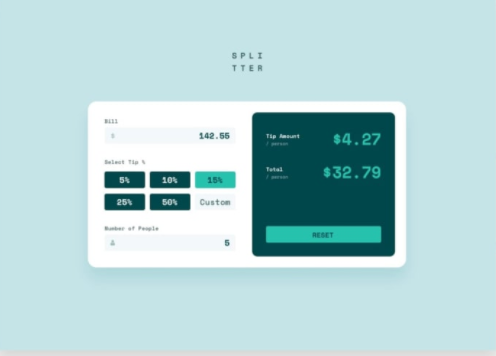
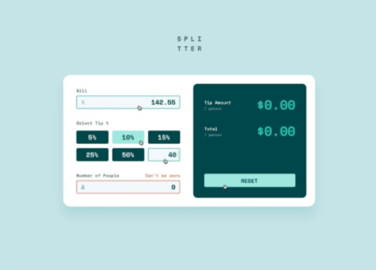
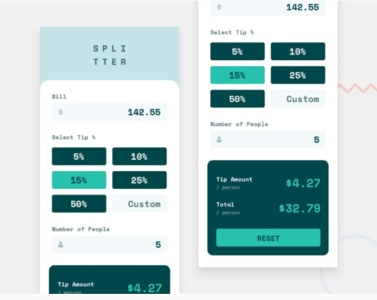

<h2>Tip calculator</h2>

This is my solution to <strong>Tip Calculator</strong> challenge by Frontendmentor.io.  which takes billing amount, type of service and a number of persons as input and then generate the tip for serving person

<h3>Live Link</h3>
<a href="https://sonakshirawat.github.io/Tip-calculator/">Click here</a>

<h3>Features</h3>
<ul>
<li>Calculate the correct tip and total cost of the bill per person</li>
<li>See the hover states for all the interactive elements on the page</li>
<li>View the optimal layout for the site depending on their device's screen size</li>
</ul>

 
<h3>Build Using</h3>
<ul>
  <li>HTML5 Markup language</li>
  <li>CSS3 Custom Properties</li>
     <li>Vanilla javascript</li>
</ul>

<h3>Screenshots</h3>
 
 

 

